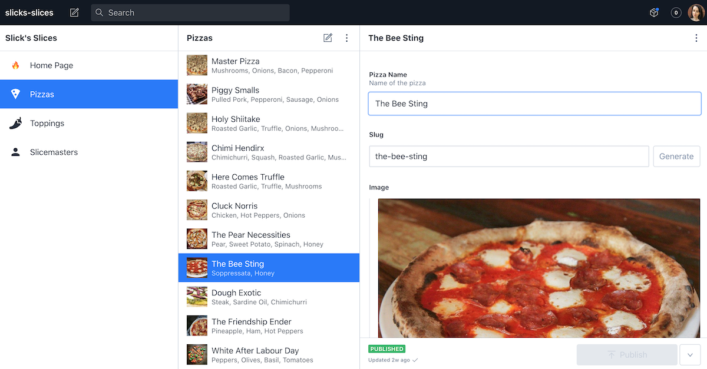

# Slicks Slices Backend

This is the backend for web application created for a fake pizza shop called Slick's Slices.

It is built with [Gatsby](https://www.gatsbyjs.com/) and uses [Sanity](https://www.sanity.io/) for a headless CMS.

⚡️ **[View Live Demo](https://slicks-slices.netlify.app/)** ⚡️

The frontend repo can be found [here](https://github.com/jrapala/slicks-slices-frontend).

## 📸 Screenshots

Screenshot of the custom CMS:

## 🚀 Local Environment Setup

1. Install dependencies with `yarn`.
2. Create a new project on [Sanity.io](https://www.sanity.io/).
3. Create a production dataset.
4. Run `$ sanity init --reconfigure` to update your Sanity config.
5. Start your dev server with `yarn start`.
6. Add data.
7. Deploy your GraphQL server with `$ sanity graphql deploy production`.

